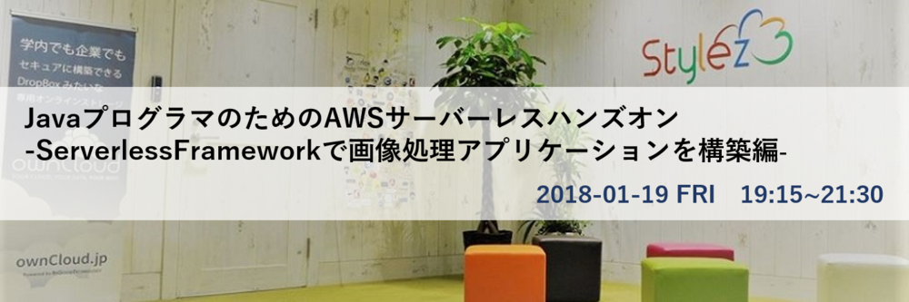
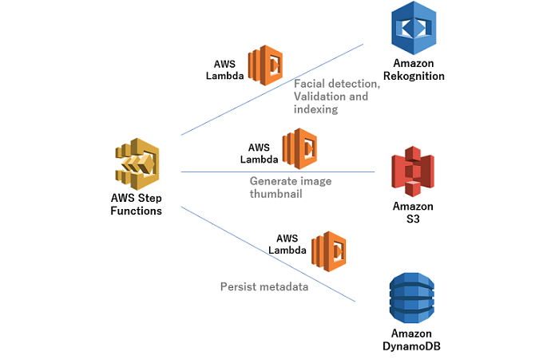
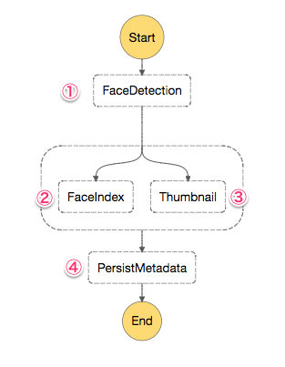
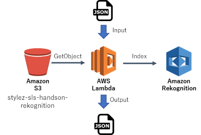
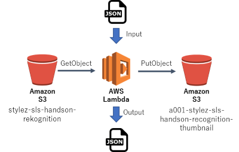
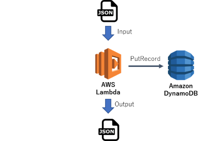
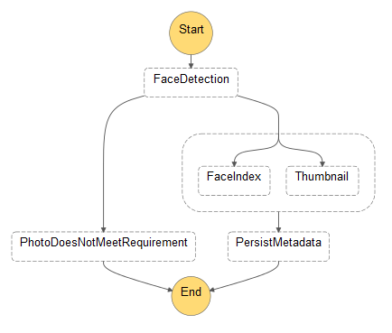

# sls-handson-2018-01-19


# JavaプログラマのためのAWSサーバーレスハンズオン-ServerlessFrameworkで画像処理アプリケーションを構築編-



## アジェンダ

|時間|内容|
|----|----|
|19:00|	受付開始 |
|19:15|	挨拶・説明等 |
|19:20|	サーバーレスの説明 |
|19:30|	ハンズオン前半戦 |
|20:20|	休憩 |
|20:30|	ハンズオン後半戦 |
|21:00|	質疑応答&名刺交換&ドリンクタイム |
|22:00| 撤収 |

## 準備 その1（ハンズオン開始前に済ませる）

### ServerlessFramework（>= 1.23.0）のインストール

* [serverless - Installation](https://serverless.com/framework/docs/providers/aws/guide/installation/)

    コマンドが通ればOKです。（インストール済の場合は次へ）
    ```
    $ sls -v
    1.23.0
    ```

### AWS CLIのインストール

* [AWS Command Line Interface のインストール](https://docs.aws.amazon.com/ja_jp/cli/latest/userguide/installing.html)

    コマンドが通ればOKです。
    ```
    $ aws --version
    aws-cli/1.11.84 Python/3.6.2 Linux/4.4.0-59-generic botocore/1.5.47
    ```

### Gitのインストール

* [Install Git | Atlassian Git Tutorial](https://www.atlassian.com/git/tutorials/install-git)

    コマンドが通ればOKです。（インストール済の場合は次へ）
    ```
    $  git --version
    git version 2.7.0
    ```

### Mavenのインストール

* [Installing Apache Maven
](https://maven.apache.org/install.html)

    コマンドが通ればOKです。（インストール済の場合は次へ）
    ```
    $ mvn --version
    Apache Maven 3.3.9 (bb52d8502b132ec0a5a3f4c09453c07478323dc5; 2015-11-11T01:41:47+09:00)
    ```

## 準備 その2（来場時に設定する）

### ハンズオン用のAWS Profile設定

* 来場時に配布されたユーザー情報を確認してください。
* プロファイル名 `sls-handson` で、プロファイルを設定してください。
* デフォルトリージョンは `us-east-1` としてください。

    ```
    $ aws configure --profile sls-handson
    AWS Access Key ID [None]: ${ユーザー情報.AccessKey}
    AWS Secret Access Key [None]: ${ユーザー情報.SecretKey}
    Default region name [None]: `us-east-1`
    Default output format [None]: `json`
    ```

* 以下のコマンドでプロファイルが正常に設定されているか確認してください。
* JPEGがリストアップされればOKです。

    ```
    $ aws s3 ls s3://stylez-sls-handson-rekognition --profile sls-handson
    2018-01-12 15:49:59     743327 1_happy_face.jpg
    2018-01-12 15:49:58     884422 2_sunglass_face.jpg
    2018-01-12 15:49:56     959216 3_multiple_faces.jpg
    2018-01-12 15:49:55    1114024 4_no_face.jpg
    ```

### HelloWorld（時間がある人のみ）
<details>
<summary><strong>ServerlessFramework HelloWorld (expand for details)</strong></summary><p>

1. 任意のディレクトリに移動します。
1. templateからgenerateします。（ `--name` には、来場時に配布されたユーザー情報の `no` を指定してください。  ）
    ```
    $ sls create --template aws-java-maven --path hello  --name ${ユーザー情報.no}
    Serverless: Generating boilerplate...
    Serverless: Generating boilerplate in "/Users/bgt/Documents/git/serverlessframework/hello"
     _______                             __
    |   _   .-----.----.--.--.-----.----|  .-----.-----.-----.
    |   |___|  -__|   _|  |  |  -__|   _|  |  -__|__ --|__ --|
    |____   |_____|__|  \___/|_____|__| |__|_____|_____|_____|
    |   |   |             The Serverless Application Framework
    |       |                           serverless.com, v1.23.0
     -------'
    
    Serverless: Successfully generated boilerplate for template: "aws-java-maven"
    ```

1. generateされたディレクトリに移動します。
    ```
    $ cd hello
    ```

1. Mavenパッケージを実行します。
    ```
    $ mvn clean package
    [INFO] Scanning for projects...
    [INFO]
    [INFO] ------------------------------------------------------------------------
    [INFO] Building hello dev
    [INFO] ------------------------------------------------------------------------
    ～～～～～～
    [INFO] ------------------------------------------------------------------------
    [INFO] BUILD SUCCESS
    [INFO] ------------------------------------------------------------------------
    [INFO] Total time: 3.640 s
    [INFO] Finished at: 2018-01-14T17:42:08+09:00
    [INFO] Final Memory: 23M/176M
    [INFO] ------------------------------------------------------------------------
    
    ```

* ServerlessFrameworkでデプロイします。
    ```
    $ sls deploy --aws-profile sls-handson
    Serverless: Packaging service...
    Serverless: Creating Stack...
    Serverless: Checking Stack create progress...
    ～～～～～～
    Serverless: Stack update finished...
    Service Information
    service: a001
    stage: dev
    region: us-east-1
    stack: a001-dev
    api keys:
      None
    endpoints:
      None
    functions:
      hello: a001-dev-hello
    ```

* ServerlessFrameworkでLambda invokeします。
    ```JSON
    $ sls invoke --function hello --data '{"key1":"value1","key2":"value2","key3":"value3"}' --aws-profile sls-handson
    {
        "statusCode": 200,
        "body": "{\"message\":\"Go Serverless v1.x! Your function executed successfully!\",\"input\":{\"key1\":\"value1\",\"key2\":\"value2\",\"key3\":\"value3\"}}",
        "headers": {
            "X-Powered-By": "AWS Lambda & serverless"
        },
        "isBase64Encoded": false
    }
    ```
</details>

## ハンズオン

### 概要

* awslabsの[aws-serverless-workshops](https://github.com/awslabs/aws-serverless-workshops)を参考に、サーバーレス画像処理アプリケーションの構築ハンズオンを行います。

* アーキテクチャは、Amazon Rekognitionの顔検出機能を活用し、Amazon S3に格納されているアップロードされた画像のリサイズ、Amazon DynamoDBを使用して画像のメタデータをユーザープロファイルに保存する、いくつかのAWS Lambda関数で構成されています。これらのLambda関数のオーケストレーションは、AWS Step Functionステートマシンによって管理されます。

* また、各AWS Lambda関数はSpringCloudフレームワークにより実装し。各AWS Lambda関数及び、AWS Step FunctionステートマシンはServerlessFrameworkにてDeployします。

    

### 処理フロー

* 以下は、AWS Step Functionで可視化したフロー図です。

    

1. [FaceDetaction](https://github.com/sls-handson/face-detection) - 以下のJsonをInputにS3に保存された指定の画像をAmazon Rekognitionの顔検出機能により、サングラスを掛けていない顔が1つであること、既にAmazon Rekognitionのコレクションに追加されてない顔あることをチェックします。エラーが無い場合、Inputの情報に顔検出情報を追加した情報を出力します。
    ```JSON
    # ${ユーザー情報.no} = "a001" の場合
    {
      "userId": "a001",
      "s3Bucket": "stylez-sls-handson-rekognition",
      "s3Key": "1_happy_face.jpg",
      "collectionId": "a001-rekognition"
    }
    ```
1. [FaceIndex](https://github.com/sls-handson/face-index) - 1の出力情報をInputにAmazon Rekognitionのコレクションに顔を追加します。
1. [Thumbnail](https://github.com/sls-handson/thumbnail) - 1の出力情報をInputにThumbnail用のbucketにリサイズした画像を保存します。
1. [PersistMetadata](https://github.com/sls-handson/persist-metadata) - 2と3の処理の完了後、1の出力情報と2と3それぞれの出力結果を合わせたメタ情報をAmazon DynamoDBに保存します。


## 実装手順

以下の各セクションでは、実装の概要と詳細なステップバイステップの手順を説明します。

### 1. Amazon Rekognitionでコレクションを作成する

* 顔画像を検索可能なベクトルとして保存するAmazon Rekognitionのコンテナであるコレクションを作成します。
* AWS CLIを使用して、Amazon Referentionに `${ユーザー情報.no}-rekognition` というコレクションを作成します

<details>
<summary><strong>Step-by-step instructions (expand for details)</strong></summary><p>

1. AWS CLIで次のコマンドを実行します。 `${ユーザー情報.no}` 部分を来場時に配布されたユーザー情報の `no` に置き換えます。

	```
	$ aws rekognition create-collection --region us-east-1 --collection-id ${ユーザー情報.no}-rekognition --profile sls-handson
	```
	For example:
	```
	$ aws rekognition create-collection --region us-east-1 --collection-id a001-rekognition --profile sls-handson
	```
	
1. 以下のような結果が出力されれば成功です。
	```JSON
	{
    	"CollectionArn": "aws:rekognition:us-east-1:012345678912:collection/a001-rekognition",
    	"StatusCode": 200
	}
	```
</p></details>

### 2. FaceDetaction関数をDeployする

* [Github](https://github.com/sls-handson/face-detection)にあるテンプレートからServerlessFrameworkでFaceDetaction関数を Build -> Deployします。

* FaceDetaction関数の処理イメージ

    
		
<details>
<summary><strong>Step-by-step instructions (expand for details)</strong></summary><p>

1. ベースとなる任意のディレクトリに移動します。

1. ServerlessFrameworkで次のコマンドを実行して関数をgenerateします。

	```
	$ sls create --template-url https://github.com/sls-handson/face-detection --path face-detection
	Serverless: Generating boilerplate...
	Serverless: Downloading and installing "face-detection"...
	Serverless: Successfully installed "undefined"
	```
	バージョンによっては、 `template-url` が対応していないので、エラーの場合は以下を実行します:
	```
	$ sls install --url https://github.com/sls-handson/face-detection --name face-detection
	```

1. generateされたディレクトリに移動します。

	```
	$ cd face-detection
	```

1. Mavenパッケージを実行します。`${ユーザー情報.no}` 部分を来場時に配布されたユーザー情報の `no` に置き換えます。

	```
	$ mvn clean package -Dno=${ユーザー情報.no}
	```

	For example:
	```
	$ mvn clean package -Dno=a001
	[INFO] Scanning for projects...
	[INFO]
	[INFO] ------------------------------------------------------------------------
	[INFO] Building aws-spring-cloud-function-maven dev
	[INFO] ------------------------------------------------------------------------
	～～～～
	[INFO] Attaching shaded artifact.
	[INFO] ------------------------------------------------------------------------
	[INFO] BUILD SUCCESS
	[INFO] ------------------------------------------------------------------------
	[INFO] Total time: 31.265 s
	[INFO] Finished at: 2018-01-15T15:18:45+09:00
	[INFO] Final Memory: 51M/459M
	[INFO] ------------------------------------------------------------------------
	```

1. ServerlessFrameworkでデプロイします。 `${ユーザー情報.no}` 部分を来場時に配布されたユーザー情報の `no` に置き換えます。

	```
	$ sls deploy --no ${ユーザー情報.no}
	```
	For example:
	```
	$ sls deploy --no a001
	Serverless: Packaging service...
	Serverless: Uploading CloudFormation file to S3...
	Serverless: Uploading artifacts...
	Serverless: Validating template...
	Serverless: Updating Stack...
	Serverless: Checking Stack update progress...
	...............
	Serverless: Stack update finished...
	Service Information
	service: a001-face-detection
	stage: dev
	region: us-east-1
	stack: a001-face-detection-dev
	api keys:
	  None
	endpoints:
	  None
	functions:
	  put: a001-face-detection-dev-put
	```

1. ServerlessFrameworkでLambda invokeします。 `${ユーザー情報.no}` 部分を来場時に配布されたユーザー情報の `no` に置き換えます。

	```
	$ sls invoke -f put --no ${ユーザー情報.no} --data '{"userId": "a002", "s3Bucket": "stylez-sls-handson-rekognition", "s3Key": "1_happy_face.jpg", "collectionId": "${ユーザー情報.no}-rekognition"}'
	```
	For example:
	```
	$ sls invoke -f put --no a001 --data '{"userId": "a001", "s3Bucket": "stylez-sls-handson-rekognition", "s3Key": "1_happy_face.jpg", "collectionId": "a001-rekognition"}'
	{
    "userId": "a001",
    "s3Key": "1_happy_face.jpg",
    "s3Bucket": "stylez-sls-handson-rekognition",
    "collectionId": "a001-rekognition",
    "detectedFaceDetails": {
	～～～～	
			"quality": {
				"brightness": 60.96304,
				"sharpness": 99.99671
			},
			"confidence": 99.7335
		}
	}

	```
</p></details>

### 3. FaceIndex関数をDeployする
* [Github](https://github.com/sls-handson/face-index)にあるテンプレートからServerlessFrameworkでFaceIndex関数を Build -> Deployします。

* FaceIndex関数の処理イメージ

    

<details>
<summary><strong>Step-by-step instructions (expand for details)</strong></summary><p>

1. ベースとなる任意のディレクトリに移動します。

1. ServerlessFrameworkで次のコマンドを実行して関数をgenerateします。

	```
	$ sls create --template-url https://github.com/sls-handson/face-index --path face-index
	Serverless: Generating boilerplate...
	Serverless: Downloading and installing "face-index"...
	Serverless: Successfully installed "undefined"
	```
	バージョンによっては、 `template-url` が対応していないので、エラーの場合は以下を実行します:
	```
	$ sls install --url https://github.com/sls-handson/face-index --name face-index
	```

1. generateされたディレクトリに移動します。

	```
	$ cd face-index
	```

1. Mavenパッケージを実行します。`${ユーザー情報.no}` 部分を来場時に配布されたユーザー情報の `no` に置き換えます。

	```
	$ mvn clean package -Dno=${ユーザー情報.no}
	```

	For example:
	```
	$ mvn clean package -Dno=a001
	[INFO] Scanning for projects...
	[INFO]
	[INFO] ------------------------------------------------------------------------
	[INFO] Building aws-spring-cloud-function-maven dev
	[INFO] ------------------------------------------------------------------------
	～～～～
	[INFO] Attaching shaded artifact.
	[INFO] ------------------------------------------------------------------------
	[INFO] BUILD SUCCESS
	[INFO] ------------------------------------------------------------------------
	[INFO] Total time: 31.265 s
	[INFO] Finished at: 2018-01-15T15:18:45+09:00
	[INFO] Final Memory: 40M/413M
	[INFO] ------------------------------------------------------------------------
	```

1. ServerlessFrameworkでデプロイします。 `${ユーザー情報.no}` 部分を来場時に配布されたユーザー情報の `no` に置き換えます。

	```
	$ sls deploy --no ${ユーザー情報.no}
	```
	For example:
	```
	$ sls deploy --no a001
	Serverless: Packaging service...
	Serverless: Uploading CloudFormation file to S3...
	Serverless: Uploading artifacts...
	Serverless: Validating template...
	Serverless: Updating Stack...
	Serverless: Checking Stack update progress...
	...............
	Serverless: Stack update finished...
	Service Information
	service: a001-face-index
	stage: dev
	region: us-east-1
	stack: a001-face-index-dev
	api keys:
	  None
	endpoints:
	  None
	functions:
	  put: a001-face-index-dev-put
	```

1. ServerlessFrameworkでLambda invokeします。 `${ユーザー情報.no}` 部分を来場時に配布されたユーザー情報の `no` に置き換えます。

	```JSON
	$ sls invoke -f put --no ${ユーザー情報.no} --data '{"userId": "a002", "s3Bucket": "stylez-sls-handson-rekognition", "s3Key": "1_happy_face.jpg", "collectionId": "${ユーザー情報.no}-rekognition"}'
	```
	For example:
	```JSON
	$ sls invoke -f put --no a001 --data '{"userId": "a001", "s3Bucket": "stylez-sls-handson-rekognition", "s3Key": "1_happy_face.jpg", "collectionId": "a001-rekognition"}'
	{
	    "faceId": "207320e7-xxx-463b-xxx-654a9f9efc38",
	    "boundingBox": {
	        "width": 0.46666667,
	        "height": 0.7,
	        "left": 0.5025,
	        "top": 0.1025
	    },
	    "imageId": "e9f8a7af-affa-5040-ad4f-7dcee5f69880",
	    "externalImageId": "1_happy_face.jpg",
	    "confidence": 99.7335
	}
	```

1. AWS CLIで顔がコレクションに登録されているか確認します。`${ユーザー情報.no}` 部分を来場時に配布されたユーザー情報の `no` に置き換えます。

	```
	$ aws rekognition list-faces --collection-id ${ユーザー情報.no}-rekognition --profile sls-handson
	```
	For example:
	```
	$ aws rekognition list-faces --collection-id a001-rekognition --profile sls-handson
	{
			"FaceModelVersion": "2.0",
			"Faces": [
					{
							"BoundingBox": {
									"Width": 0.4666669964790344,
									"Top": 0.10249999910593033,
									"Left": 0.5024999976158142,
									"Height": 0.699999988079071
							},
							"FaceId": "207320e7-xxxx-463b-xxxx-654a9f9efc38",
							"ExternalImageId": "1_happy_face.jpg",
							"Confidence": 99.73350524902344,
							"ImageId": "e9f8a7af-affa-5040-ad4f-7dcee5f69880"
					}
			]
	}
	```

1. 後続の確認でストッパーになるので、登録された顔をコレクションから削除するために以下のコマンドを実行します。`${ユーザー情報.no}` 部分を来場時に配布されたユーザー情報の `no` に置き換えます。 `${faceId}` 部分を上記で確認したFaceIDの値に置き換えます。

	```
	$ aws rekognition delete-faces --collection-id ${ユーザー情報.no}-rekognition --face-ids "${faceId}" --profile sls-handson
	```
	For example:
	```
	$ aws rekognition delete-faces --collection-id a001-rekognition --face-ids "207320e7-xxxx-463b-xxxx-654a9f9efc38" --profile sls-handson
	{
			"DeletedFaces": [
					"207320e7-xxxx-463b-xxxx-654a9f9efc38"
			]
	}

	```
</p></details>

### 4. Thumbnail関数をDeployする
* [Github](https://github.com/sls-handson/thumbnail)にあるテンプレートからServerlessFrameworkでFaceIndex関数を Build -> Deployします。

* Thumbnail関数の処理イメージ

    


<details>
<summary><strong>Step-by-step instructions (expand for details)</strong></summary><p>

1. ベースとなる任意のディレクトリに移動します。

1. ServerlessFrameworkで次のコマンドを実行して関数をgenerateします。

	```
	$ sls create --template-url https://github.com/sls-handson/thumbnail --path thumbnail
	Serverless: Generating boilerplate...
	Serverless: Downloading and installing "thumbnail"...
	Serverless: Successfully installed "undefined"
	```
	バージョンによっては、 `template-url` が対応していないので、エラーの場合は以下を実行します:
	```
	$ sls install --url https://github.com/sls-handson/thumbnail --name thumbnail
	```

1. generateされたディレクトリに移動します。

	```
	$ cd thumbnail
	```

1. Mavenパッケージを実行します。`${ユーザー情報.no}` 部分を来場時に配布されたユーザー情報の `no` に置き換えます。

	```
	$ mvn clean package -Dno=${ユーザー情報.no}
	```

	For example:
	```
	$ mvn clean package -Dno=a001
	[INFO] Scanning for projects...
	[INFO]
	[INFO] ------------------------------------------------------------------------
	[INFO] Building aws-spring-cloud-function-maven dev
	[INFO] ------------------------------------------------------------------------
	～～～～
	[INFO] Attaching shaded artifact.
	[INFO] ------------------------------------------------------------------------
	[INFO] BUILD SUCCESS
	[INFO] ------------------------------------------------------------------------
	[INFO] Total time: 31.265 s
	[INFO] Finished at: 2018-01-15T15:18:45+09:00
	[INFO] Final Memory: 57M/326M
	[INFO] ------------------------------------------------------------------------
	```

1. ServerlessFrameworkでデプロイします。 `${ユーザー情報.no}` 部分を来場時に配布されたユーザー情報の `no` に置き換えます。<br>尚、デプロイ時にServeressFrameworkの [Resources](https://serverless.com/framework/docs/providers/aws/guide/resources/) によりThumbnail用のバケットが生成されます。

	Thumbnail用バケット名: `${ユーザー情報.no}-stylez-sls-handson-rekognition-thumbnails`

	```
	$ sls deploy --no ${ユーザー情報.no}
	```
	For example:
	```
	$ sls deploy --no a001
	Serverless: Packaging service...
	Serverless: Uploading CloudFormation file to S3...
	Serverless: Uploading artifacts...
	Serverless: Validating template...
	Serverless: Updating Stack...
	Serverless: Checking Stack update progress...
	...............
	Serverless: Stack update finished...
	Service Information
	service: a001-thumbnail
	stage: dev
	region: us-east-1
	stack: a001-thumbnail-dev
	api keys:
	  None
	endpoints:
	  None
	functions:
	  put: a001-thumbnail-dev-put
	```

1. ServerlessFrameworkでLambda invokeします。 `${ユーザー情報.no}` 部分を来場時に配布されたユーザー情報の `no` に置き換えます。

	```
	$ sls invoke -f put -p event.json --no ${ユーザー情報.no}
	```
	For example:
	```
	$ sls invoke -f put -p event.json --no a001
	{
	    "thumbnail": {
	        "s3Key": "1_happy_face.jpg",
	        "s3Bucket": "a001-stylez-sls-handson-rekognition-thumbnails"
	    }
	}
	```

1. AWS CLIでThumbnail用バケットにThumbnail画像が作成されているか確認します。`${ユーザー情報.no}` 部分を来場時に配布されたユーザー情報の `no` に置き換えます。

	```
	$ aws s3 ls s3://${ユーザー情報.no}-stylez-sls-handson-rekognition-thumbnails/ --profile sls-handson
	```
	For example:
	```
	$ aws s3 ls s3://a001-stylez-sls-handson-rekognition-thumbnails/ --profile sls-handson
	2018-01-15 17:41:38       8113 1_happy_face.jpg
	```

1. 後続の確認でストッパーになるので、Thumbnail画像をThumbnail用バケットから削除するために以下のコマンドを実行します。`${ユーザー情報.no}` 部分を来場時に配布されたユーザー情報の `no` に置き換えます。 `${faceId}` 部分を上記で確認したFaceIDの値に置き換えます。

	```
	$ aws s3 rm s3://${ユーザー情報.no}-stylez-sls-handson-rekognition-thumbnails/1_happy_face.jpg --profile sls-handson
	```
	For example:
	```
	$ aws s3 rm s3://a001-stylez-sls-handson-rekognition-thumbnails/1_happy_face.jpg --profile sls-handson
	delete: s3://a001-stylez-sls-handson-rekognition-thumbnails/1_happy_face.jpg
	```

</p></details>

### 5. PersistMetadata関数をDeployする
* [Github](https://github.com/sls-handson/persist-metadata)にあるテンプレートからServerlessFrameworkでFaceIndex関数を Build -> Deployします。

* Thumbnail関数の処理イメージ

    

<details>
<summary><strong>Step-by-step instructions (expand for details)</strong></summary><p>

1. ベースとなる任意のディレクトリに移動します。

1. ServerlessFrameworkで次のコマンドを実行して関数をgenerateします。

	```
	$ sls create --template-url https://github.com/sls-handson/persist-metadata --path persist-metadata
	Serverless: Generating boilerplate...
	Serverless: Downloading and installing "persist-metadata"...
	Serverless: Successfully installed "undefined"
	```
	バージョンによっては、 `template-url` が対応していないので、エラーの場合は以下を実行します:
	```
	$ sls install --url https://github.com/sls-handson/persist-metadata --name persist-metadata
	```

1. generateされたディレクトリに移動します。

	```
	$ cd persist-metadata
	```

1. Mavenパッケージを実行します。`${ユーザー情報.no}` 部分を来場時に配布されたユーザー情報の `no` に置き換えます。

	```
	$ mvn clean package -Dno=${ユーザー情報.no}
	```

	For example:
	```
	$ mvn clean package -Dno=a001
	[INFO] Scanning for projects...
	[INFO]
	[INFO] ------------------------------------------------------------------------
	[INFO] Building aws-spring-cloud-function-maven dev
	[INFO] ------------------------------------------------------------------------
	～～～～
	[INFO] Attaching shaded artifact.
	[INFO] ------------------------------------------------------------------------
	[INFO] BUILD SUCCESS
	[INFO] ------------------------------------------------------------------------
	[INFO] Total time: 31.265 s
	[INFO] Finished at: 2018-01-15T15:18:45+09:00
	[INFO] Final Memory: 57M/258M
	[INFO] ------------------------------------------------------------------------
	```

1. ServerlessFrameworkでデプロイします。 `${ユーザー情報.no}` 部分を来場時に配布されたユーザー情報の `no` に置き換えます。<br>尚、デプロイ時にServeressFrameworkの [Resources](https://serverless.com/framework/docs/providers/aws/guide/resources/) によりAmazon DynamoDBのテーブルが生成されます。

	Amazon DynamoDBのテーブル名: `${ユーザー情報.no}-ImageProcessing`

	```
	$ sls deploy --no ${ユーザー情報.no}
	```
	For example:
	```
	$ sls deploy --no a001
	Serverless: Packaging service...
	Serverless: Uploading CloudFormation file to S3...
	Serverless: Uploading artifacts...
	Serverless: Validating template...
	Serverless: Updating Stack...
	Serverless: Checking Stack update progress...
	...............
	Serverless: Stack update finished...
	Service Information
	service: a001-persist-metadata
	stage: dev
	region: us-east-1
	stack: a001-persist-metadata-dev
	api keys:
	  None
	endpoints:
	  None
	functions:
	  put: a001-persist-metadata-dev-put
	```

1. ServerlessFrameworkでLambda invokeします。 `${ユーザー情報.no}` 部分を来場時に配布されたユーザー情報の `no` に置き換えます。

	```
	$ sls invoke -f put -p event.json --no ${ユーザー情報.no}
	```
	For example:
	```
	$ sls invoke -f put -p event.json --no a001
	{
	    "userId": "johndoe",
	    "s3Key": "1_happy_face.jpg",
	    "s3Bucket": "wildrydes-riderphotos-johndoe",
	    "collectionId": null,
	    "parallelResult": [
	        {
	            "FaceId": "00f884e1-31d4-5b7f-bcb2-bc91a51d3713",
	            "BoundingBox": {
	                "Width": 0.476666659116745,
	                "Height": 0.7149999737739563,
	                "Left": 0.4977777898311615,
	                "Top": 0.09000000357627869
	            },
	            "ImageId": "fbda5555-463d-5964-acef-035061fb819f",
	            "ExternalImageId": "johndoe",
	            "Confidence": 99.92555236816406
	        },
	        {
	            "thumbnail": {
	                "s3key": "resized-1_happy_face.jpg",
	                "s3bucket": "wildrydes-riderphotos-thumbnails-johndoe"
	            }
	        }
	    ]
	}
	```

1. AWS CLIでテーブルにメタ情報が登録されているか確認します。`${ユーザー情報.no}` 部分を来場時に配布されたユーザー情報の `no` に置き換えます。

	```
	aws dynamodb query \
    --table-name ${ユーザー情報.no}-ImageProcessing \
    --key-condition-expression "username = :username" \
    --expression-attribute-values  '{":username":{"S":"johndoe"}}' --profile sls-handson
	```
	For example:
	```
	aws dynamodb query \
    --table-name a001-ImageProcessing \
    --key-condition-expression "username = :username" \
    --expression-attribute-values  '{":username":{"S":"johndoe"}}' --profile sls-handson
	{
	    "Count": 1,
	    "Items": [
	        {
	            "s3bucket": {
	                "S": "wildrydes-riderphotos-johndoe"
	            },
	            "username": {
	                "S": "johndoe"
	            },
	            "faceId": {
	                "S": "00f884e1-31d4-5b7f-bcb2-bc91a51d3713"
	            },
	            "s3key": {
	                "S": "1_happy_face.jpg"
	            },
	            "thumbnail": {
	                "M": {
	                    "s3bucket": {
	                        "S": "wildrydes-riderphotos-thumbnails-johndoe"
	                    },
	                    "s3key": {
	                        "S": "resized-1_happy_face.jpg"
	                    }
	                }
	            }
	        }
	    ],
	    "ScannedCount": 1,
	    "ConsumedCapacity": null
	}
	```
</p></details>

### 6. AWS Step FunctionステートマシンをDeployする
* [Github](https://github.com/sls-handson/step-function)にあるテンプレートからServerlessFrameworkでAWS Step Functionステートマシンを Deployします。
* AWS Step Functionステートマシンのワークフローイメージ。

    

<details>
<summary><strong>Step-by-step instructions (expand for details)</strong></summary><p>

1. ベースとなる任意のディレクトリに移動します。

1. ServerlessFrameworkで次のコマンドを実行して関数をgenerateします。

	```
	$ sls create --template-url https://github.com/sls-handson/step-function --path step-function
	Serverless: Generating boilerplate...
	Serverless: Downloading and installing "step-function"...
	Serverless: Successfully installed "undefined"
	```
	バージョンによっては、 `template-url` が対応していないので、エラーの場合は以下を実行します:
	```
	$ sls install --url https://github.com/sls-handson/step-function --name step-function
	```

1. generateされたディレクトリに移動します。

	```
	$ cd step-function
	```


1. ServerlessFrameworkのAWS Step Functionプラグインをインストールします。

	```
	$ npm install --save-dev serverless-step-functions
	npm WARN saveError ENOENT: no such file or directory, open 'E:\work\desktop\work\sls_handson\20180115\persist-metadata\package.json'
	npm notice created a lockfile as package-lock.json. You should commit this file.
	npm WARN enoent ENOENT: no such file or directory, open 'E:\work\desktop\work\sls_handson\20180115\persist-metadata\package.json'
	npm WARN persist-metadata No description
	npm WARN persist-metadata No repository field.
	npm WARN persist-metadata No README data
	npm WARN persist-metadata No license field.

	+ serverless-step-functions@1.3.0
	added 32 packages in 4.705s
	```

	プラグインの確認:
	```
	$ npm list --depth=0
	$ /step-function
	+-- serverless-step-functions@1.3.0
	```

1. ServerlessFrameworkの疑似パラメータ参照プラグインをインストールします。

	```
    $ npm install serverless-pseudo-parameters
	npm WARN saveError ENOENT: no such file or directory, open 'E:\work\desktop\work\sls_handson\20180115\step-function\package.json'
	npm WARN enoent ENOENT: no such file or directory, open 'E:\work\desktop\work\sls_handson\20180115\step-function\package.json'
	npm WARN step-function No description
	npm WARN step-function No repository field.
	npm WARN step-function No README data
	npm WARN step-function No license field.

	+ serverless-pseudo-parameters@1.1.6
	added 1 package in 1.325s
	```

	プラグインの確認:
	```
	$ npm list --depth=0
	$ /step-function
	+-- serverless-pseudo-parameters@1.1.6
	`-- serverless-step-functions@1.3.0
	```

1. ServerlessFrameworkでデプロイします。 `${ユーザー情報.no}` 部分を来場時に配布されたユーザー情報の `no` に置き換えます。

	```
	$ sls deploy --no ${ユーザー情報.no}
	```
	For example:
	```
	$ sls deploy --no a001
	Serverless: Packaging service...
	AWS Pseudo Parameters
	AWS Pseudo Parameter: IamRoleStateMachineExecution::AssumeRolePolicyDocument::Statement::0::Principal::Service Replaced Region with ${AWS::Region}
	AWS Pseudo Parameter: IamRoleStateMachineExecution::Policies::0::PolicyName Replaced Region with ${AWS::Region}
	AWS Pseudo Parameter: SlsHandsonMachineStepFunctionsStateMachine::DefinitionString Replaced Region with ${AWS::Region}
	AWS Pseudo Parameter: SlsHandsonMachineStepFunctionsStateMachine::DefinitionString Replaced AccountId with ${AWS::AccountId}
	AWS Pseudo Parameter: SlsHandsonMachineStepFunctionsStateMachine::DefinitionString Replaced Region with ${AWS::Region}
	AWS Pseudo Parameter: SlsHandsonMachineStepFunctionsStateMachine::DefinitionString Replaced AccountId with ${AWS::AccountId}
	AWS Pseudo Parameter: SlsHandsonMachineStepFunctionsStateMachine::DefinitionString Replaced Region with ${AWS::Region}
	AWS Pseudo Parameter: SlsHandsonMachineStepFunctionsStateMachine::DefinitionString Replaced AccountId with ${AWS::AccountId}
	AWS Pseudo Parameter: SlsHandsonMachineStepFunctionsStateMachine::DefinitionString Replaced Region with ${AWS::Region}
	AWS Pseudo Parameter: SlsHandsonMachineStepFunctionsStateMachine::DefinitionString Replaced AccountId with ${AWS::AccountId}
	Serverless: Creating Stack...
	Serverless: Checking Stack create progress...
	.....
	Serverless: Stack create finished...
	Serverless: Uploading CloudFormation file to S3...
	Serverless: Uploading artifacts...
	Serverless: Validating template...
	Serverless: Updating Stack...
	Serverless: Checking Stack update progress...
	.........
	Serverless: Stack update finished...
	Service Information
	service: a001-sls-handson-step-functions
	stage: dev
	region: us-east-1
	stack: a001-sls-handson-step-functions-dev
	api keys:
	  None
	endpoints:
	  None
	functions:
	  None
	Serverless StepFunctions OutPuts
	endpoints:
	```

1. ServerlessFrameworkでAWS Step Functionステートマシン を invokeします。 `${ユーザー情報.no}` 部分を来場時に配布されたユーザー情報の `no` に置き換えます。

	```JSON
	$ sls invoke stepf --name slsHandsonMachine --no ${ユーザー情報.no} \
	    --data '{"userId": "${ユーザー情報.no}", "s3Bucket": "stylez-sls-handson-rekognition", "s3Key": "1_happy_face.jpg", "collectionId": "${ユーザー情報.no}-rekognition"}'
	```
	For example:
	```JSON
	$ sls invoke stepf --name slsHandsonMachine --no a001 \
	    --data '{"userId": "a001", "s3Bucket": "stylez-sls-handson-rekognition", "s3Key": "1_happy_face.jpg", "collectionId": "a001-rekognition"}'
	.........
	{ executionArn: 'arn:aws:states:us-east-1:184619842885:execution:SlsHandsonMachineStepFuncti-EpOJONuPX5xK:e0697714-2662-40c5-9be3-8fca1c2a97d1',
	  stateMachineArn: 'arn:aws:states:us-east-1:184619842885:stateMachine:SlsHandsonMachineStepFuncti-EpOJONuPX5xK',
	  name: 'e0697714-2662-40c5-9be3-8fca1c2a97d1',
	  status: 'SUCCEEDED',
	  startDate: 2018-01-15T10:42:05.611Z,
	  stopDate: 2018-01-15T10:42:54.168Z,
	  input: '{"userId": "a001", "s3Bucket": "stylez-sls-handson-rekognition", "s3Key": "1_happy_face.jpg", "collectionId": "a001-rekognition"}',
	  output: '{"userId":"a001","s3Key":"1_happy_face.jpg","s3Bucket":"stylez-sls-handson-rekognition","collectionId":"a001-rekognition","parallelResult":[{"faceId":"78ec9f93-4bca-4c57-9f0c-fdedfe690ae1","boundingBox":{"width":0.46666667,"height":0.7,"left":0.5025,"top":0.1025},"imageId":"e9f8a7af-affa-5040-ad4f-7dcee5f69880","externalImageId":"1_happy_face.jpg","confidence":99.7335},{"thumbnail":{"s3Key":"1_happy_face.jpg","s3Bucket":"a001-stylez-sls-handson-rekognition-thumbnails"}}]}' }
	```
</p></details>

## 実装の検証

1. 以下の異なるテスト画像を使用して出力結果を検証します。 `${ユーザー情報.no}` 部分を来場時に配布されたユーザー情報の `no` に置き換えます。

	サングラス付き写真（2_sunglass_face.jpg）：

	```JSON
	$ sls invoke stepf --name slsHandsonMachine --no ${ユーザー情報.no} \
	--data '{"userId": "user_b", "s3Bucket": "stylez-sls-handson-rekognition", "s3Key": "2_sunglass_face.jpg", "collectionId": "${ユーザー情報.no}-rekognition"}'
	```

	複数の顔を含む写真（3_multiple_faces.jpg）：
	
	```JSON
	$ sls invoke stepf --name slsHandsonMachine --no ${ユーザー情報.no} \
	--data '{"userId": "user_c", "s3Bucket": "stylez-sls-handson-rekognition", "s3Key": "3_multiple_faces.jpg", "collectionId": "${ユーザー情報.no}-rekognition"}'
	```
	
	顔のない写真（4_no_face.jpg）：

	```JSON
	$ sls invoke stepf --name slsHandsonMachine --no ${ユーザー情報.no} \
	--data '{"userId": "user_d", "s3Bucket": "stylez-sls-handson-rekognition", "s3Key": "4_no_face.jpg", "collectionId": "${ユーザー情報.no}-rekognition"}'
	```
	
1. S3にいくつかの写真をアップロードし、いくつかの実行をテストします。同じ人物の写真が複数ある場合は、それらをアップロードして、各写真でワークフローを実行してください（テスト入力で異なる 'userId`フィールドを使用してください）。 同じ顔が複数回インデックスされないようにします。

	S3に写真（a001_01_face.jpg）をアップロードする場合：

	```JSON
	$ aws s3 cp a001_01_face.jpg s3://stylez-sls-handson-rekognition/a001_01_face.jpg --profile sls-handson
	```

1. 以下のコマンドを参考にAmazon DynamoDB のテーブルへの登録状況を確認します。 `${ユーザー情報.no}` 部分を来場時に配布されたユーザー情報の `no` に置き換えます。
	
	`user_a` の登録レコードを確認する場合：

	```
	aws dynamodb query \
    --table-name ${ユーザー情報.no}-ImageProcessing \
    --key-condition-expression "username = :username" \
    --expression-attribute-values  '{":username":{"S":"user_a"}}' --profile sls-handson
	```

1. 以下のコマンドを参考にThumbnail用バケットに 処理したThumbnail画像が存在することを確認します。 `${ユーザー情報.no}` 部分を来場時に配布されたユーザー情報の `no` に置き換えます。

	`user_a` の登録レコードを確認する場合：

	```
	$ aws s3 ls s3://${ユーザー情報.no}-stylez-sls-handson-rekognition-thumbnails/ --profile sls-handson
	2018-01-15 17:41:38       8113 1_happy_face.jpg
	2018-01-15 18:41:38       8113 a001_01_face.jpg
	```

## Extra credit

**FaceDetaction関数** では、幾つかのValidationを行い、エラーの場合はExceptionを返しています。AWS Step Functionのエラーハンドリング機能を利用して、当該Taskでエラーが発生した場合にエラーを処理するタスクに渡すワークフローを検討します。

* 以下は、AWS Step Functionで可視化したフロー図です。

    

### 1. PhotoDoesNotMeetRequiremen関数を実装、Deployする

PhotoDoesNotMeetRequiremen関数を今までの実習の内容を基に実装、Deployします。

<details>
<summary><strong>Step-by-step instructions (expand for details)</strong></summary><p>

1. まず、FaceDetectionでエラーとなった場合、以下のJsonが出力されることを知ってください。

	```JSON
	{
		"Error": "exception.PhotoDoesNotMeetRequirementError",
		"Cause": "{
			"errorMessage": "Face is wearing sunglasses",
			"errorType": "exception.PhotoDoesNotMeetRequirementError",
			"stackTrace":[
				・・・,
			]
		}"
	}
	```
	* 上記JsonをInputとして、何れかの処理を行う。Lambda関数を実装します。
	* 以下は、Inputで受け取ったJsonをそのまま出力するサンプルですが、Amazon Simple Email Service（SES）を使用して、電子メール通知を送信するといったユースケースを検討することが考えられます。また、SpringFunction を活用した実装も考えられます。

		[mock-notification](https://github.com/sls-handson/mock-notification)

1. 実装が完了したら、他の関数と同様にServerlessFrameworkにてDeployします。`${ユーザー情報.no}` 部分を来場時に配布されたユーザー情報の `no` に置き換えます。

	```
	$ sls deploy --no ${ユーザー情報.no}
	```
1. ServerlessFrameworkでLambda invokeし、単体レベルで問題ないことを確認します。 `${ユーザー情報.no}` 部分を来場時に配布されたユーザー情報の `no` に置き換えます。

	```
	$ sls invoke -f put -p event.json --no ${ユーザー情報.no}
	```
</p></details>

### 2. AWS Step Functionステートマシンを修正する。

上記で実装したLambda関数をAWS Step FunctionステートマシンにTaskとして追加します。

<details>
<summary><strong>Step-by-step instructions (expand for details)</strong></summary><p>

1. ベースとなる任意のディレクトリに移動します。

1. 対象のディレクトリに移動します。

	```
	$ cd step-function
	```

1. 現状AWS Step Functionステートマシンを削除します。

	```
	$ sls remove --no ${ユーザー情報.no}
	```

1. `serverless.yml` を修正します。

	28行目付近の `Next: Parallel` と `Parallel:` の間に以下を追記します。

	```
            Next: Parallel
            Catch: 
              - ErrorEquals:
                - exception.PhotoDoesNotMeetRequirementError
                Next: PhotoDoesNotMeetRequirement
          PhotoDoesNotMeetRequirement: 
            Type: Task
            Resource: arn:aws:lambda:#{AWS::Region}:#{AWS::AccountId}:function:${opt:no}-mock-notification-dev-put
            End: true
          Parallel:
	```
1. ServerlessFrameworkでデプロイします。 `${ユーザー情報.no}` 部分を来場時に配布されたユーザー情報の `no` に置き換えます。

	```
	$ sls deploy --no ${ユーザー情報.no}
	```
</p></details>

### 3. 実装を検証する。

FaceDetaction関数でValidationエラーとなるシナリオを検証します。

<details>
<summary><strong>Step-by-step instructions (expand for details)</strong></summary><p>

1. ServerlessFrameworkでAWS Step Functionステートマシン を invokeします。 `${ユーザー情報.no}` 部分を来場時に配布されたユーザー情報の `no` に置き換えます。

	サングラス付き写真（2_sunglass_face.jpg）：

	```JSON
	$ sls invoke stepf --name slsHandsonMachine --no ${ユーザー情報.no} --data '{"userId": "user_b", "s3Bucket": "stylez-sls-handson-rekognition", "s3Key": "2_sunglass_face.jpg", "collectionId": "${ユーザー情報.no}-rekognition"}'
	```

1. Exceptionではなく、意図した処理が実行されることを確認します。

	For example（サンプルの場合は標準出力）：

	```JSON
	{
	executionArn: 'arn:aws:states:us-east-1:184619842885:execution:SlsHandsonMachineStepFuncti-TxDqKVb3TZjR:236ba66e-9934-4f80-93e2-274b4574eafa',
	stateMachineArn: 'arn:aws:states:us-east-1:184619842885:stateMachine:SlsHandsonMachineStepFuncti-TxDqKVb3TZjR',
	name: '236ba66e-9934-4f80-93e2-274b4574eafa',
	status: 'SUCCEEDED',
	startDate: 2018-01-15T14:07:34.647Z,
	stopDate: 2018-01-15T14:07:36.596Z,
	input: '{"userId": "user_b", "s3Bucket": "stylez-sls-handson-rekognition", "s3Key": "2_sunglass_face.jpg", "collectionId": "a001-rekognition"}',
	output: '{
	"Error":"exception.PhotoDoesNotMeetRequirementError",
	"Cause":"{"errorMessage":"Face is wearing sunglasses",
	"errorType":"exception.PhotoDoesNotMeetRequirementError",
	"stackTrace":[・・・]
	}"}'
	```
</p></details>

## Clean-up 

1. AWS Step Functionステートマシンを削除する
	<details>
	<summary><strong>Step-by-step instructions (expand for details)</strong></summary><p>
	
	1. ベースとなる任意のディレクトリに移動します。

	1. 対象のディレクトリに移動します。

		```
		$ cd step-function
		```

	1. ServerlessFrameworkでremoveします。`${ユーザー情報.no}` 部分を来場時に配布されたユーザー情報の `no` に置き換えます。

		```
		$ sls remove --no ${ユーザー情報.no}
		```
		For example:
		```
		$ sls remove --no a001
		Serverless: Getting all objects in S3 bucket...
		Serverless: Removing objects in S3 bucket...
		Serverless: Removing Stack...
		Serverless: Checking Stack removal progress...
		......
		Serverless: Stack removal finished...
		```
	</p></details>

1. PersistMetadata関数を削除する
	<details>
	<summary><strong>Step-by-step instructions (expand for details)</strong></summary><p>
	
	1. ベースとなる任意のディレクトリに移動します。

	1. 対象のディレクトリに移動します。

		```
		$ cd persist-metadata
		```

	1. ServerlessFrameworkでremoveします。`${ユーザー情報.no}` 部分を来場時に配布されたユーザー情報の `no` に置き換えます。<br/>
	**尚、Amazon DynamoDBのテーブルについても同時に削除されます。**

		```
		$ sls remove --no ${ユーザー情報.no}
		```
		For example:
		```
		$ sls remove --no a001
		Serverless: Getting all objects in S3 bucket...
		Serverless: Removing objects in S3 bucket...
		Serverless: Removing Stack...
		Serverless: Checking Stack removal progress...
		......
		Serverless: Stack removal finished...
		```
	</p></details>
	
1. Thumbnail関数を削除する
	<details>
	<summary><strong>Step-by-step instructions (expand for details)</strong></summary><p>
	
	1. ベースとなる任意のディレクトリに移動します。

	1. 対象のディレクトリに移動します。

		```
		$ cd thumbnail
		```

	1. AWS CLIにて、Thumbnail用バケットを空にします。`${ユーザー情報.no}` 部分を来場時に配布されたユーザー情報の `no` に置き換えます。

		```
		$ aws s3 rm s3://${ユーザー情報.no}-stylez-sls-handson-rekognition-thumbnails --recursive --profile sls-handson
		```

	1. ServerlessFrameworkでremoveします。`${ユーザー情報.no}` 部分を来場時に配布されたユーザー情報の `no` に置き換えます。<br/>
	**尚、Thumbnail用のバケットについても同時に削除されます。**

		```
		$ sls remove --no ${ユーザー情報.no}
		```
		For example:
		```
		$ sls remove --no a001
		Serverless: Getting all objects in S3 bucket...
		Serverless: Removing objects in S3 bucket...
		Serverless: Removing Stack...
		Serverless: Checking Stack removal progress...
		......
		Serverless: Stack removal finished...
		```
	</p></details>

1. FaceIndex関数を削除する
	<details>
	<summary><strong>Step-by-step instructions (expand for details)</strong></summary><p>
	
	1. ベースとなる任意のディレクトリに移動します。

	1. 対象のディレクトリに移動します。

		```
		$ cd face-index
		```

	1. ServerlessFrameworkでremoveします。`${ユーザー情報.no}` 部分を来場時に配布されたユーザー情報の `no` に置き換えます。

		```
		$ sls remove --no ${ユーザー情報.no}
		```
		For example:
		```
		$ sls remove --no a001
		Serverless: Getting all objects in S3 bucket...
		Serverless: Removing objects in S3 bucket...
		Serverless: Removing Stack...
		Serverless: Checking Stack removal progress...
		......
		Serverless: Stack removal finished...
		```
	</p></details>

1. FaceDetaction関数を削除する
	<details>
	<summary><strong>Step-by-step instructions (expand for details)</strong></summary><p>
	
	1. ベースとなる任意のディレクトリに移動します。

	1. 対象のディレクトリに移動します。

		```
		$ cd face-detection
		```

	1. ServerlessFrameworkでremoveします。`${ユーザー情報.no}` 部分を来場時に配布されたユーザー情報の `no` に置き換えます。

		```
		$ sls remove --no ${ユーザー情報.no}
		```
		For example:
		```
		$ sls remove --no a001
		Serverless: Getting all objects in S3 bucket...
		Serverless: Removing objects in S3 bucket...
		Serverless: Removing Stack...
		Serverless: Checking Stack removal progress...
		......
		Serverless: Stack removal finished...
		```
	</p></details>

1. Amazon Rekognitionのコレクションを削除する
	<details>
	<summary><strong>Step-by-step instructions (expand for details)</strong></summary><p>

	1. AWS CLIで以下のコマンドを実行します。`${ユーザー情報.no}` 部分を来場時に配布されたユーザー情報の `no` に置き換えます。<br/>

		```
		$ aws rekognition delete-collection --region us-east-1 --collection-id ${ユーザー情報.no}-rekognition --profile sls-handson
		```
		For example:
		```
		$ aws rekognition delete-collection --region us-east-1 --collection-id a001-rekognition --profile sls-handson
		```

	1. 以下のような結果が出力されれば成功です。
		```
		{
		    "StatusCode": 200
		}
		```
	</p></details>

## 参考

* [aws-serverless-workshops ImageProcessing](https://github.com/awslabs/aws-serverless-workshops/tree/master/ImageProcessing)
* [Serverless AWS Lambda Guide](https://serverless.com/framework/docs/providers/aws/guide/)
* [serverless-step-functions](https://github.com/horike37/serverless-step-functions)